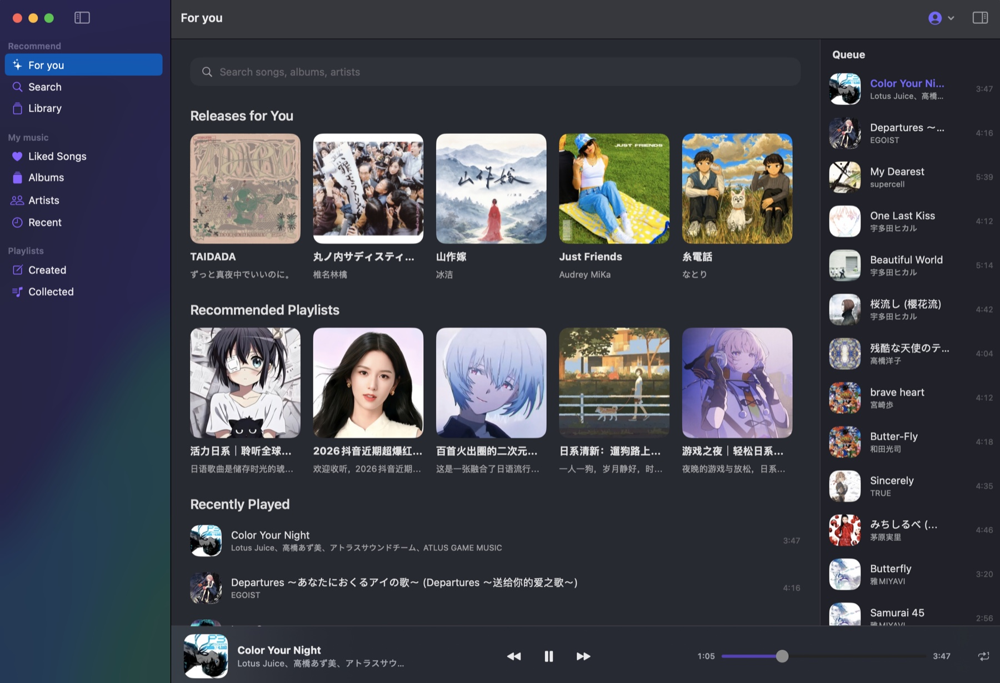
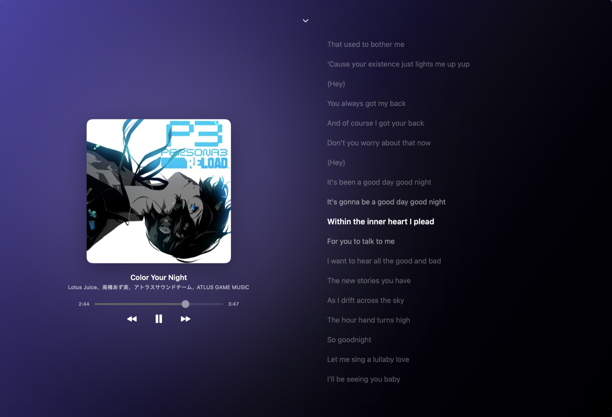
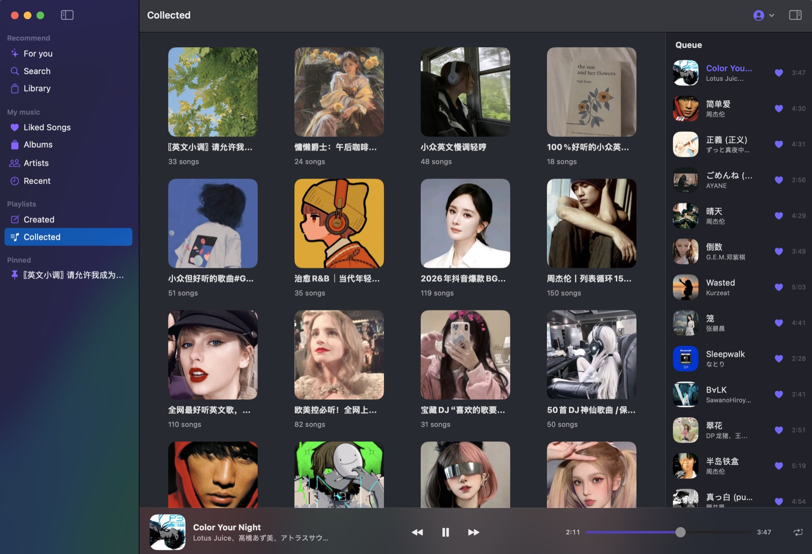
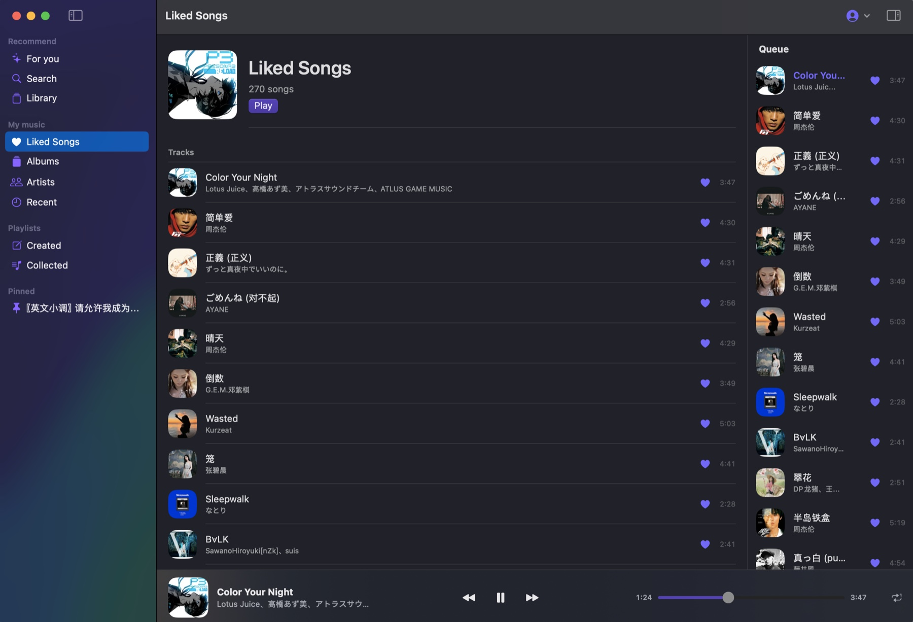

# AstraMusic

macOS 原生的酷狗音乐客户端，用 SwiftUI 写的个人学习项目。

> ⚠️ **非官方项目，与酷狗音乐没有任何关系。** 使用前请务必阅读[免责声明](#免责声明--disclaimer)。

## 功能

- **发现** — 每日推荐、排行榜歌单
- **搜索** — 歌曲 / 专辑 / 歌手 / 歌单混合结果
- **资料库** — 我喜欢的音乐、创建与收藏的歌单、收藏的专辑、关注的歌手、本机最近播放
- **播放** — 播放队列、四种播放模式（随机 / 列表循环 / 单曲循环 / 顺序）、进度与音量
- **歌词** — 逐行滚动，支持 KRC 与 LRC
- **账号** — 扫码 / 手机验证码 / 密码登录；云端点赞、加歌单、关注、收藏
- **界面** — 深色 / 浅色自适应，Now Playing 常驻底栏，封面 / 歌词可全屏

## 截图

| | |
|---|---|
|  |  |
|  |  |

## 系统要求

| | |
|---|---|
| 系统 | macOS 15.5 或更高 |
| 预编译版本 | Apple Silicon（arm64） |
| 从源码构建 | Xcode 16 + Node.js 18 或更高 + pnpm |

## 安装

### 预编译版本

两种方式任选其一。**不需要安装 Node** —— API 服务已随 App 打包，启动时自动拉起、退出时自动回收。

#### 方式一：Homebrew

```bash
brew trust dabrlin/astramusic
brew install --cask dabrlin/astramusic/astramusic
```

Homebrew 6 起，第三方 tap 需要先 `brew trust` 才会加载其中的 cask——这一步不能省。
升级用 `brew upgrade --cask astramusic`；卸载用 `brew uninstall --cask astramusic`（加 `--zap` 会连本地数据一起删掉）。

#### 方式二：直接下载 DMG

从 [Releases](https://github.com/DabRlin/AstraMusic/releases) 下载 `AstraMusic-v<版本>.dmg`，打开后把 App 拖进「应用程序」。

#### 首次打开需要右键（两种方式都一样）

> ⚠️ 本项目没有 Apple 公证（没有付费开发者账号），直接双击会被系统拦下。请**右键点 App → 打开**，在弹窗里再点一次「打开」；此后双击即可正常使用。**Homebrew 也不会跳过这一步。**
>
> 若仍被拦截，可清除隔离标记：`xattr -dr com.apple.quarantine /Applications/AstraMusic.app`

### 从源码构建

```bash
git clone https://github.com/DabRlin/AstraMusic.git
cd AstraMusic

# 1) 准备本地 API 服务（首次需要；需要 pnpm，如 npm i -g pnpm@9）
cd Sidecar && pnpm install --frozen-lockfile && cd ..

# 2) 编译 app
xcodebuild -project AstraMusic.xcodeproj -scheme AstraMusic -configuration Debug \
  -destination 'platform=macOS' CODE_SIGNING_ALLOWED=NO build
```

也可以直接用 Xcode 打开 `AstraMusic.xcodeproj` 后按 ⌘R。

#### 启动本地 API 服务

从源码运行（Xcode / 上面的命令）时 bundle 里没有内置服务，需要自己起一个 —— 登录、搜索、播放都依赖它，**不启动就没有任何内容**：

```bash
cd Sidecar && node app.js --platform=lite --port=6521
```

App 默认连接 `http://127.0.0.1:6521`，并且会**复用**已经在该端口上的服务（所以开发时手动起的那个和打包版内置的那个可以互换）。

### 使用

需要登录酷狗账号（默认扫码，也支持手机验证码 / 密码）。本项目**没有游客模式**，未登录时所有页面都是登录入口。

## 卸载与清理

### Homebrew 安装的

```bash
brew uninstall --cask astramusic
```

加 `--zap` 会连资料库、偏好等本地数据一起删除。

### 用仓库里的脚本（更彻底）

`Script/` 下有三个脚本，都不需要 sudo，执行前会先列出要删的内容，加 `--dry-run` 只预览。先 clone 一份即可，不用构建：

```bash
git clone --depth 1 https://github.com/DabRlin/AstraMusic.git
```

| 脚本 | 做什么 | 会丢失什么 |
|---|---|---|
| [`Script/Uninstall.sh`](Script/Uninstall.sh) | 彻底卸载：应用本体 + 全部数据 | 全部 —— 像从没装过 |
| [`Script/clean_data_all.sh`](Script/clean_data_all.sh) | 清空数据，但保留 App | 喜欢 / 最近播放 / 本地歌单 / 偏好 / 登录态 |
| [`Script/clean_cache.sh`](Script/clean_cache.sh) | 只清缓存 | 不丢任何东西，封面下次用时重新下载 |

```bash
./AstraMusic/Script/Uninstall.sh       # 连 App 一起删掉
./AstraMusic/Script/clean_data_all.sh  # 保留 App：像刚装上、还没登录
./AstraMusic/Script/clean_cache.sh     # 只清缓存：歌单、最近播放、登录态都留着
```

`Uninstall.sh` 与 `clean_data_all.sh` 都会删掉钥匙串里的酷狗登录令牌，之后需要重新登录（`clean_data_all.sh --keep-login` 可以保留登录）。`clean_cache.sh` 只删封面缓存和播放时落下的临时流媒体文件 —— 后者可能攒到几百 MB，是真正值得清的那份，且不影响你的资料库。

## 已知限制

- 从源码运行需要你自己启动本地 API 服务；预编译版本自带并自动启动。
- 依赖第三方非官方接口，随时可能失效。
- 预编译版本只支持 Apple Silicon。

## 免责声明 / Disclaimer

**本项目与酷狗音乐（Kugou）及其关联公司没有任何隶属、合作、赞助或授权关系。** 它不是官方客户端，也未获官方认可。

- **仅供个人学习与技术研究**，不用于任何商业用途，不接受任何形式的捐赠或付费。
- **不提供、不托管、不分发任何音频内容。** 所有音乐数据来自第三方公开接口，音频流在你的机器上按需获取，本项目不存储、不再分发。
- **不实现任何付费内容的绕过：** 没有 VIP 破解、没有付费墙绕过、没有版权保护规避、没有验证码破解。遇到风控验证只会提示，不会自动处理。
- **商标归属：** 文中出现的「酷狗」「Kugou」等名称与标识归其各自权利人所有，本项目仅在描述性意义上使用，不构成任何背书。
- 本项目按「现状」提供，不保证可用性、稳定性或合法性，使用产生的一切后果由使用者自行承担。

**若权利人认为本项目存在侵权或不当之处，请通过本仓库的 Issue 联系，我们会在核实后立即删除相关内容或下架整个项目。**

请支持正版音乐。

### English

This project is an **unofficial client for personal study and research only**. It is **not affiliated with, authorized by, endorsed by, or sponsored by Kugou** or any of its affiliates, and it is not a commercial product.

It hosts, stores, and redistributes **no** audio content, and it implements **no** paywall, DRM, or CAPTCHA circumvention. All trademarks belong to their respective owners and are used descriptively only. The software is provided **"as is"**, without warranty of any kind.

**If you are a rights holder and believe this project infringes your rights, please open an issue in this repository — we will remove the offending content or take the project down promptly.**

## 致谢

- **[KuGouMusicApi](https://github.com/MakcRe/KuGouMusicApi)** —— 本地 API 服务的基础，`Sidecar/` 是它的快照（MIT License，见 `Sidecar/LICENSE`）。没有它就没有这个客户端。
- **[DeepSeek](https://www.deepseek.com/)** —— 模型驱动的编码助手，承担了绝大部分代码编写、重构、调试与文档工作。
- **[Zed](https://zed.dev/)** —— 高性能的协作式编辑器，本项目的主要开发环境。

感谢这些项目，让这个学习项目得以完成。

## 许可

本项目以 **Apache License 2.0** 发布，见 [LICENSE](LICENSE) 与 [NOTICE](NOTICE)。

`Sidecar/` 是第三方开源项目 [KuGouMusicApi](https://github.com/MakcRe/KuGouMusicApi) 的快照（MIT License），见 `Sidecar/LICENSE`。
